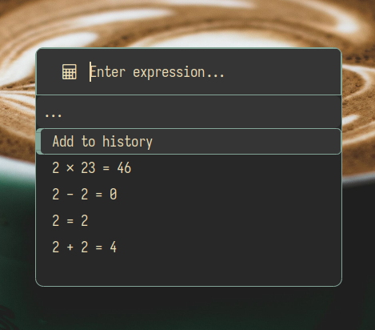
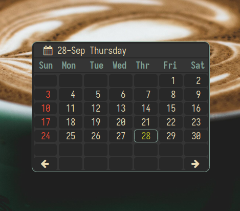

# linux dotfiles

> For backup purposes. Create you own copy(fork if you use github), as I'm constantly updating these.

## Screenshots

<b><code>Launcher</code></b>

<b><code>Emoji</code></b>

<b><code>Firefox</code></b>

<b><code>Calculator</code></b>

<b><code>Calendar</code></b>

<b><code>Bookmarks</code></b>

## Softwares

### GUI Tools

- simplescreenrecorder
    - <https://www.maartenbaert.be/simplescreenrecorder>
- xournal
    - whiteboard
- libreoffice
    - office suite
- copyq
    - clipboard manager
- flameshot
    - screenshot tool
- dolphin
    - file manager
- firefox
    - browser
- polybar
    - status bar
- freeplane
    - mindmapping tool
- mpv
    - audio/video player
- kdenlive
    - <https://kdenlive.org/en/>
    - Video editing software
- vlc
    - audio/video player
- gimp
    - image editor
- krita
    - digital art
- inkscape
    - vector images
- gThumb
    - image viewing
- rust desk
    - remote desktop connection
- zathura
    - pdf viewing

### CLI Tools

- zsh
    - shell
- vim
    - cli editor
- neovim
    - cli editor
- alacritty
    - terminal emulator
- ImageMagick
    - image editor
    - `convert` `identify` `morgify`
- feh
    - image viewer
- navi
    - <https://github.com/denisidoro/navi>
    - cheat sheet for terminal
- asciinema
    - <https://asciinema.org/>
    - record terminal in text
- bat
    - cat alternative
- lsd
    - ls alternative
- fzf
    - fizzy search
- autojump
